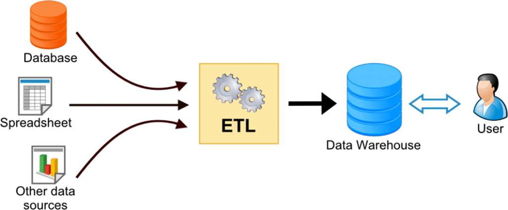
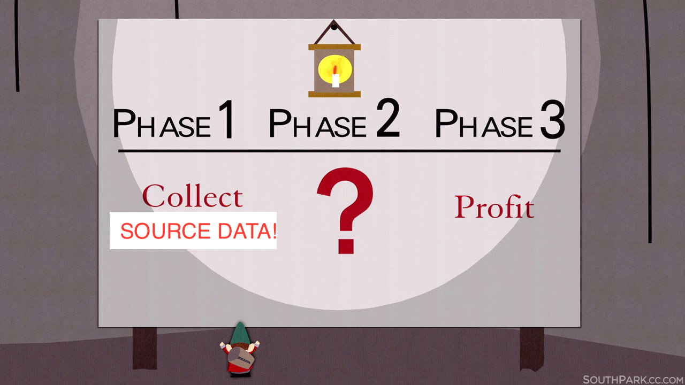

## Drupal 8 Migrate API
### ...and how to use it

Christopher J. Wells<br>
[Redfin Solutions, LLC](https://redfinsolutions.com)

twitter: @sceo<br>
d.o+drupal.slack: cwells<br>
github: chrisfromredfin

---

# Who's this clown?


---

## Overview

1. Build a Module
2. Drop your migrations in there
3. Set up some global configuration if needed
4. Extend/alter/write any custom plugins or code to support those migrations

---

## 1. Build a module

Please, use Drupal console.


==

## 1. Build a module

Need a module.info.yml file.

```
name: Diomass Migrations
type: module
description: Migration classes and configuration for diomass d6 to d8.
core: 8.x
package: Custom
dependencies:
  - migrate
  - migrate_drupal
  - migrate_plus
  - migrate_tools
```

==

## 1. Build a module: Contrib

* migrate - the core API for migrating anything into Drupal 8
* migrate_drupal - the core module for migrating FROM Drupal 6 - 8 <!-- .element: class="fragment" -->
* migrate_plus - loads of enhancements to core migrate <!-- .element: class="fragment" -->
* migrate_tools - provides drush commands to run and manage migrations <!-- .element: class="fragment" -->

_Note: important to use the correct version of these contrib modules based on your version of Drupal._ <!-- .element: class="fragment" -->

==

## 1. (Don't) Build a module: Migrate UI

The migrate_ui module also exists in core to provide a one-click upgrade from a Drupal 6 or 7 site.

---

## 2. Write Some Migrations!

The overall architecture of Migrate is an Extract, Transform, Load process.



==

## 2. Write Some Migrations: Terminology

* Extract - Source
* Transform - Process
* Load - Destination

==

## 2. Write Some Migrations: Setup

Using a "migration group" provides the ability to share some configuration between
multiple migrations.

```
# A "migration group" is - surprise! - a group of migrations. It is used to
# group migrations for display by our tools, and to perform operations on a
# specific set of migrations. It can also be used to hold any configuration
# common to those migrations, so it doesn't have to be duplicated in each one.

# The machine name of the group, by which it is referenced in individual
# migrations.
id: diomass

# A human-friendly label for the group.
label: Diomass Imports

# More information about the group.
description: A few imports for Diomass.

# Short description of the type of source, e.g. "Drupal 6" or "WordPress".
source_type: Drupal 6

# Here we add any default configuration settings to be shared among all
# migrations in the group. For this example, the source tables are in the
# Drupal (default) database, but usually if your source data is in a
# database it will be external.
shared_configuration:
  # Specifying 'source' here means that this configuration will be merged into
  # the 'source' configuration of each migration.
  source:
    # Added a database
    # connection to your external database in settings.php and reference its
    # key here.
    key: migrate
# Remove this config when the module uninstalls
dependencies:
  enforced:
    module:
      - diomass_migrations
```

==

## 2. Write Some Migrations: External Database

```
$databases['migrate']['default'] = array(
  'database' => 'databasename',
  'username' => 'dbusername',
  'password' => 'somestrongp@55w0rd',
  'prefix' => '',
  'host' => 'localhost',
  'port' => '3306',
  'namespace' => 'Drupal\\Core\\Database\\Driver\\mysql',
  'driver' => 'mysql',
);
```

==

## 2. Write Some Migrations: Initial/Global Config

Start writing configuration for your migrations. These are [YAML](http://yaml.org/).

```
# Migration configuration for site content (into basic pages).
id: diomass_site_content
label: Site Content
migration_group: diomass
# Remove this config when the module uninstalls
dependencies:
  enforced:
    module:
      - diomass_migrations
migration_dependencies:
  required:
    - d6_file
```

---

## 2. Write Some Migrations: Source

The source key of the migration is the extractor. It is responsible for getting
your data out of the place(s) where it lives.

Database example:

```
source:
  plugin: diomass_site_content
  node_type: site_content
  # and don't forget 'key: migrate' could go here if you weren't using a migration_group
  # but we are, so all the migrations in this group use the same data source
```

==

## 2. Write Some Migrations: Source (CSV)

```
source:
  plugin: debtcsv
  # Full path to the file.
  path: ../data/agopinions.csv
  # The number of rows at the beginning which are not data.
  header_row_count: 0
  # These are the field names from the source file representing the key
  # uniquely identifying each game - they will be stored in the migration
  # map table as columns sourceid1, sourceid2, and sourceid3.

  # Keys is required. Identify the column or columns that make the row unique.
  keys:
    - state
    - append_uid

  # Here we identify the columns of interest in the source file. Each numeric
  # key is the 0-based index of the column. For each column, the key below
  # (e.g., "start_date") is the field name assigned to the data on import, to
  # be used in field mappings below. The value is a user-friendly string for
  # display by the migration UI.
  column_names:
    # So, here we're saying that the first field (index 0) on each line will
    # be stored in the state field in the Row object during migration, and
    # that name can be used to map the value below. "State" will appear
    # in the UI to describe this field.
    0:
      state: State
    1:
      question: Question
    2:
      brief_answer: Brief answer
    3:
      citation: Citation
    4:
      mechanism_name: Mechanism name
    5:
      language_from_opinion: Language from the opinion
    6:
      when_applied: When does it apply
    7:
      append_uid: Appended uid
```
==

## 2. Source: Purpose

The purpose of the source plugins are to provide a uniform $row object.

`migrate/src/Row.php - Class Row {}`

Method setSourceProperty() sets values of $row->thing1, $row->thing2, etc.

\Drupal\Component\Utility\NestedArray::setvalue()

==

## 2. Source: Chase the rabbit...


==

## 2. Source: SourcePluginBase

Providing methods like:

rewind(), next(), count(), preRollback(), prepareRow()

==

## 2. Source: prepareRow()

* Lots of opportunity for magic here.
* puts the "transform" in the ETL
* direct access to Row $row to set / change values, do lookups, etc
* sanitize bad data

==

## 2. Source

* abstract class SqlBase extends SourcePluginBase
* abstract class DrupalSqlBase extends SqlBase
* abstract class FieldableEntity extends DrupalSqlBase

^ all in migrate module.

Note:
SqlBase - overrides count(), adds getDatabases()
DrupalSqlBase - adds moduleExists(), variableGet(), getModuleSchemaVersion()

==

## 2. Source

Finally ready to LEAVE Migrate module and get at the real Source.

`core/modules/node/src/Plugin/migrate/source/d7/Node.php`

* overrides query()
* overrides prepareRow()

==

## 2. Source: Constants

You can define constant values for later use by dropping them in the source
section:

```
source:
  constants:
    name_separator: ', '
```


---

## 3. ???



---

## 4. Load, AKA Destination

```
destination:
  # Here we're saying that each row of data (line from the CSV file,
  # or row from the source query, etc) will be
  # used to create a node entity.
  plugin: entity:node
  # destination plugins can have their own additional config
  default_bundle: page  # for node
  source_base_path: 'http://diomass.org'  # for file
```

==

## 4. Load / Destination

For user, there's a configuration option related to passwords.

* you provide password in plaintext or hashed/salted
* you provide an md5 (`md5_passwords: true`)

If not one of those:

* decrypt to plaintext or md5 yourself
* force users to reset password

==

## 4. Load / Destination: Entities galore!

<span class="fragment">nodes</span><span class="fragment">, users</span><span class="fragment">, comments</span><span class="fragment">, files</span><span class="fragment">, configuration</span><span class="fragment">, form display</span><span class="fragment">, entity view modes</span><span class="fragment blink">, CONTRIB!</span><span class="fragment blink">, YOUR CUSTOM MODULES!</span>

==

## 4. Load / Destination: Custom

Migrate Plus even provides a "Table" destination plugin so you can map directly
to a SQL table.

---

## (Back to) 3. Transform, AKA Process


==

## 3. Process

There are myriad process plugins to use. Fundamentally, take value(s) from
the source, map them into the destination.

* **get** - simplest to use

```
destVal: sourceVal
```

equivalent of

```
destVal:
  plugin: get
  source: sourceVal
```

`field_first_name: firstname`

==

## 3. Process

**migration_lookup**

If the source value is a reference to another value that has been previously
imported, look up the new id based on the old id.

*See migrate\_map\_MIGRATIONNAME table.*

==

## 3. Process

Chain multiple plugins in order:

```
process:
  name:
    -
      plugin: machine_name
      source: fullname
    -
      plugin: dedupe_entity
      entity_type: user
      field: name
```

==

## 3. Process

Nested values

```
process:
  'body/format':
    plugin: default_value
    default_value: 'full_html'
  'body/value': description_field
```

*NOTE: the 'primary' value (i.e. /value in this example) must be mapped
even if you don't want to map it. Can use* `body/value: {}`

==

## 3. Process: Plugins

* so far we've seen: <span class="fragment">get</span><span class="fragment">, migration_lookup</span><span class="fragment">, machine_name</span><span class="fragment">, dedupe_entity</span><span class="fragment">, default_value</span>
* but wait, there's more! <span class="fragment">concat</span><span class="fragment">, explode</span><span class="fragment">, flatten</span><span class="fragment">, static_map</span><span class="fragment">, substr</span><span class="fragment">, skip_on_empty</span><span class="fragment">, skip_row_if_not_set</span><span class="fragment">, menu_link_parent</span><span class="fragment blink">, callback</span>

Note:
static_map - throws exception unless bypass:true; skip_on_empty can be property or whole row; callback, put in .module file

==

## 3. Process: Plugins - Iterator

There's one more special process plugin, "iterator."

This is used when you have an array of structured data:
```
$row->people = Array
  [0] => Array
    [firstname] => Chris
    [lastname] => Wells
    [city] => Kennebunk
  [1] => Array
    [firstname] => Christina
    [lastname] => Costello
    [city] => Portland
  [2] => Aray
    [firstname] => Brett
    [lastname] => Wilson
    [city] => Portland
```

==

## 3. Process: Plugins - Iterator
```
process:
  people:
    plugin: iterator
    source: thepeople
    process:
      field_fullname:
        plugin: concat
        source:
          - lastname
          - firstname
        delimiter: constants/name_separator
      field_current_city: city
```

*Note: most likely you will find yourself using this on files and links.*

==

## 3. Process: Plugins

Contrib can provide, or you can write your own.

Migrate_plus, for example, also provides:

* entity_lookup (great for mapping terms from term names)
* entity_generate (great for creating taxonomy terms on the fly)

---

## 5. Putting it all together

* You've got a module that depends on these great migrate modules.
* You've configured your migration group and source.
* You've written migration YAML files
  * global config (id, group, etc), source, process, destination, dependencies, migration_dependencies
* You're running them with drush!

==

## 5. Putting it all together: Drush

* Drush commands to manage migrations - ones I use
  * migrate-status - where are things at?
  * migrate-import - run a migration (or group)
  * migrate-rollback - "un-run" a migration (or group)
  * migrate-reset-status - when you break your code and it dies, fix it

==

## 5. Putting it all together: Drush

Ones I don't use:

  * migrate-stop - stop a running migration
  * migrate-fields-source - list available source fields for a migration
  * migrate-messages - show messages relevant to a finished migration

---

## Questions?


